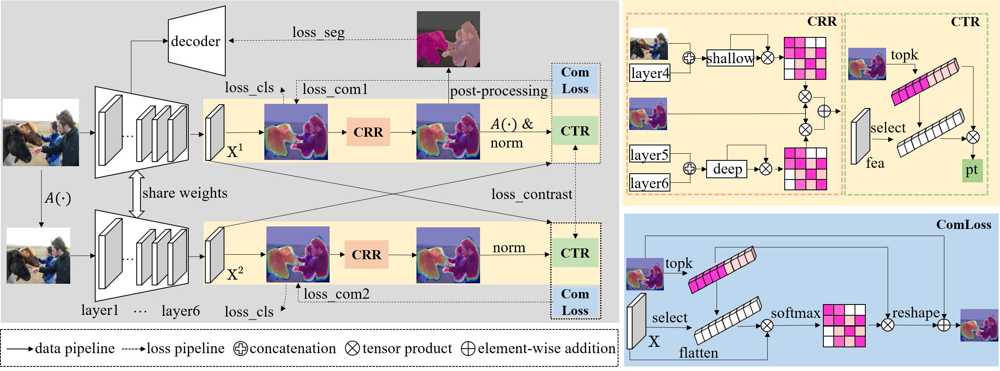
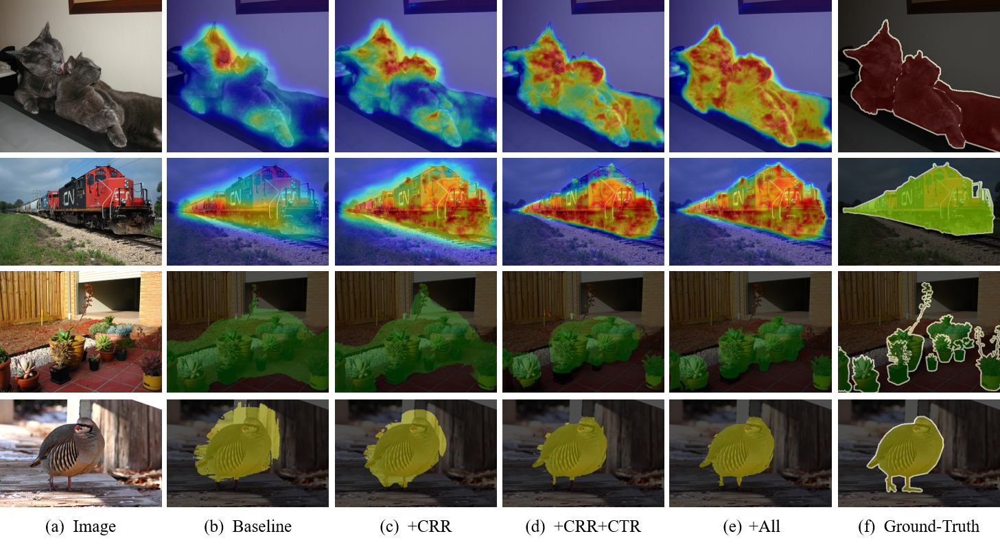

# Boosting Weakly-Supervised Image Segmentation via Representation, Transform, and Compensator

This repository contains the official PyTorch implementation of the following paper:

#### [Boosting Weakly-Supervised Image Segmentation via Representation, Transform, and Compensator](http://arxiv.org/abs/2309.00871)
Chunyan Wang, Dong Zhang, Rui Yan

## Abstract 
<p align="justify">
Weakly-supervised image segmentation (WSIS) is a critical task in computer vision that relies on image-level class labels. Multi-stage training procedures have been widely used in existing WSIS approaches to obtain high-quality pseudo-masks as ground-truth, resulting in significant progress. However,single-stage WSIS methods have recently gained attention due to their potential for simplifying training procedures, despite often suffering from low-quality pseudo-masks that limit their practical applications. To address this issue, we propose a novel single-stage WSIS method that utilizes a siamese network with contrastive learning to improve the quality of class activation maps (CAMs) and achieve a self-refinement process. Our approach employs a cross-representation refinement method that expands reliable object regions by utilizing different feature representations from the backbone. Additionally, we introduce a cross-transform regularization module that learns robust class prototypes for contrastive learning and captures global context information to feed back rough CAMs, thereby improving the quality of CAMs. Our final high-quality CAMs are used as pseudo-masks to supervise the segmentation result. Experimental results on the PASCAL VOC 2012 dataset demonstrate that our method significantly outperforms other state-of-the-art methods, achieving 67.2% and 68.76% mIoU on PASCAL VOC 2012 val set and test set, respectively. Furthermore, our method has been extended to weakly supervised object localization task, and experimental results demonstrate that our method continues to achieve very competitive results.

## The overall architecture
<br> 

## Qualitative results
<br>


## Requirements
- Python=3.6.9
- pytorch=1.7.0
- torchvision=0.8.1
- CUDA=11.0
- pydensecrf from https://github.com/lucasb-eyer/pydensecrf
- others (requirements.txt)


## Preparation

1. Data preparation.
   Download PASCAL VOC 2012 devkit following instructions in http://host.robots.ox.ac.uk/pascal/VOC/voc2012/#devkit. 
   Then download the annotation of VOC 2012 trainaug set (containing 10582 images) from https://www.dropbox.com/s/oeu149j8qtbs1x0/SegmentationClassAug.zip?dl=0 and place them all as 
   ```./VOC2012/SegmentationClassAug/xxxxxx.png```. 
2. Download pre-trained models.
   Download the pretrained resnet38 weight: [ilsvrc-cls_rna-a1_cls1000_ep-0001.params](https://drive.google.com/file/d/1W6NJmhu77ZlXidvCEhEj5jHOIHo_oFKe/view?usp=sharing) (pre-trained on ImageNet)  and place them into 
   `./models/`.
   
 

## Model Zoo
   Download the trained models and category performance below.
   | Backbone | Val | +CRF | weight link |
|:---:|:---:|:---:|---:|
| WideResNet38 | 65.34 | 67.20 | [rtc_contrast_best.pth](https://drive.google.com/file/d/1d_vTG6JII0Ab9ql3yYfGhuHOxaF_8aMw/view?usp=sharing) |

we also release the masks predicted by this model:

| Split | IoU | +CRF | result link |
|:---:|:---:|:---:|:---:|
| val | 65.34 | 67.20 | [val_results.tar](https://drive.google.com/file/d/1DX55z_mdTHULE7vM9KVk1uE0x9TY4DwS/view?usp=sharing) | 
| test | 66.90 | 68.76 | [test_results.tar](https://drive.google.com/file/d/15itzd4M6_fEFErpfUIZ_HFxueYQuU_uQ/view?usp=sharing) |


## Usage

### single-stage WSIS.
1. Training. Here, $pretrained_model=models/ilsvrc-cls_rna-a1_cls1000_ep-0001.params, $bs=8:
   ```
   python contrast_train.py  \
     --weights $pretrained_model \
     --voc12_root VOC2012 \
     --session_name $your_session_name \
     --batch_size $bs
   ```

2. Inference.

   Download the pretrained model from https://drive.google.com/file/d/1d_vTG6JII0Ab9ql3yYfGhuHOxaF_8aMw/view?usp=sharing, set ```--weights``` and then run:
   ```
   python contrast_infer.py \
     --weights $contrast_weight \ 
     --infer_list $[voc12/val.txt | voc12/test.txt] \
     --out_cam $your_cam_npy_dir \
     --out_cam_pred $your_cam_png_dir \
     --out_crf $your_crf_png_dir
   ```

<!--3. Evaluation.

   Following SEAM, you can use ```--curve``` to select an optimial background threshold for val set.
   ```
   python eval.py \
     --list VOC2012/ImageSets/Segmentation/$[val.txt] \
     --predict_dir $your_result_dir \
     --gt_dir VOC2012/SegmentationClass \
     --comment $your_comments \
     --type $[npy | png] \
     --curve True
   ```  -->


### two-stage WSIS: Segmentation training with DeepLab
1. Training. 
   
   we use the segmentation repo from https://github.com/YudeWang/semantic-segmentation-codebase. Training and inference codes are available in ```segmentation/experiment/```. Set ```DATA_PSEUDO_GT: $your_pseudo_label_path``` in ```config.py```. Here, we provide our pseduo-masks ([https://drive.google.com/file/d/1vMe4qqAMKYtlibUZrYraRotdfZ4R0ko_/view?usp=sharing]) generated by the single-stage RTC. Then run:
   ```
   python train.py
   ```

2. Inference. 

   Check test configration in ```config.py``` and val/test set selection in ```test.py```.  Then run: <!-- (trained model: https://1drv.ms/u/s!AgGL9MGcRHv0mQgpb3QawPCsKPe9?e=4vly0H)-->
   ```
   python test.py
   ```
   
   For test set evaluation, you need to download test set images and submit the segmentation results to the official voc server.
   

## Acknowledgements
We sincerely thank [Ye Du](https://arxiv.org/abs/2110.07110) for his great work in CVPR 2022. We borrow codes heavly from his repositories [WSEG](https://github.com/usr922/wseg).

<!-- ## Citation
```
@inproceedings{xxx,
  title={Boosting Weakly-Supervised Image Segmentation via Representation, Transform, and Compensator },
  author={Chunyan Wang, Dong Zhang, Rui Yan},
  booktitle={xxx},
  year={2023}
}
``` -->
